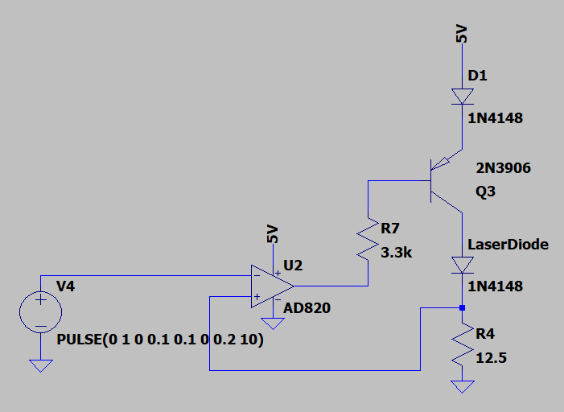

## Silicon Photonic Biosensor Evaluation System

The biggest project that I worked on during my final year at UBC was an evaluation system for a silicon photonic biosensor, which I worked on in a team of 6 for our capstone project.

A silicon photonic biosensor is basically a silicon chip with tiny waveguides etched onto the surface. This can be used as a biosensor by etching some clever patterns that allow one to measure the change in refractive index of the surface of the chip, and binding antibodies specific to an analyte that you want to measure to the surface of the chip. This way, when a desired analyte binds to the antibodies on the surface of the chip, the refractive index on the surface of the chip changes, and by putting light into the chip and measuring the light output, one can determine the concentration of analyte. The exact response of the chip that we want to measure is a wavelength response, where we sweep the wavelength of input light and measure the light transmitted to the output. This is essentially what our evaluation system does. It controls a low-cost laser to tune its wavelength output to sweep through a wavelength range, sends that light into the biosensor, and then we measure the light output on the output of the device. We also have to tightly control the temperature of the laser and the silicon photonic chip as they are extremely sensitive to changes in temperature. The evaluation system combines all these functions onto a single, low-cost board, where common lab setups for these experiments involve tens to hundreds of thousands of dollars of equipment spread across an entire lab bench. This system is a bridge to a portable, point-of-care system that could be used in rural health-care settings.

My role in the team was to lead the electronics hardware design. Over the course of our project, we produced two hardware revisions: one with the microcontroller, power supplies, photodiode measurement circuits, and temperature controller, and one with all that (with minor changes) and another board that a co-op student working on the project had made grafted onto our board.

I'm writing about this project from an electrical perspective, but this was a highly multidisciplinary project, so there was a huge amount of other work done in photonics, firmware/software, control systems, mechanical design, microfluidics, and other fields to make this project happen. I worked with a really excellent team and client and we all learned a lot about all these areas, so by no means is this an exhaustive summary of all the great work that was done on this project!

### Requirements

We recognized early on that this was going to be a very complex project on a very accelerated timeline with a very small budget, so our biggest priorities were modularity, hackability, and the minimization of risk. We were very aware of the fact that we would be spending a lot of time testing the hardware and making spur-of-the-moment modifications to fix issues that arise, and we wanted to make that as easy as we possibly could. Also we were operating on a shoestring budget, only having money for two assembled prototypes, so we emphasized modularity where we could to swap things out if we needed to repair them. One example of this is that we opted to integrate the microcontroller through headers connecting to a Nucleo-144 breakout board.

These requirements did mean that we opted not to optimize in some areas that we could have. For instance, our board ended up being about 10" wide by 11" tall, because we wanted to make it as easy to assemble and modify as possible.

### Photodiode/transimpedance amplifiers

To measure the optical output of the chip, we used photodiodes. These are diodes that have been optimized to produce a current output proportional to the optical power incident upon the photodiode. To avoid excessively loading the photodiode output by measuring it and to convert the very small output current to a usable output voltage, we used transimpedance amplifiers. This project presented the competing requirements to have the evaluation system be low-cost while also having low optical measurement noise and capacity for 16 photodiode input channels. This meant that our transimpedance amplifier design had to be both low-cost and low-noise, which is a challenge. We used [Analog Devices' Photodiode Circuit Design Wizard](https://tools.analog.com/en/photodiode/) to give us a starting point that we could build upon. This pointed us to the AD8657 op-amp, a dual op-amp package that would be relatively cheap with relatively low noise in our desired quantities. This design was further refined with our own noise analysis and LTSpice noise simulations to get the lowest noise possible. We also added an offset voltage from a precision voltage reference to the noninverting input of the op-amp so that the output signal of the op-amp was always greater than 0V, so we could measure it with common single-ended ADCs.

Luckily, our signals were basically DC, so our bandwidth could be quite low and we could use analog filtering to remove a lot of the higher-frequency noise from our signals.

Pursuant to our priority of modularity, we had our photodiodes mounted on breakout boards with TVS diodes to protect the pins. Photodiodes are extremely susceptible to being destroyed by ESD, so we wanted to minimize the risk of them getting destroyed as well as make it easy to replace them if they did.

We chose the AD4695BCPZ ADC for it's low input-referred RMS noise and 16 input channels. We also made use of oversampling to improve the noise performance of the overall analog front end system. This was the first project that I truly understood the power of oversampling, and how it can basically increase your sampling resolution by a couple of bits if you're OK with a lower sampling rate. Pretty cool!

### Temperature Controller

The temperature controller circuit was a neat part of this device. We needed to control the temperature of both the laser and the photonic integrated circuit, which are both controlled by Peltier modules. We originally inherited a temperature controller design created by a co-op student who previously worked on the project, which involved operating a thermoelectric controller IC in open-loop mode to drive the Peltier modules, and then perform control using a PID controller on the microcontroller.

We weren't able to get this circuit to work on our first prototype, and time was running out before we had to order the next revision, so we spent an entire evening brainstorming options. We figured that creating a new design that we actually understood would be a better use of time than simply re-implementing the existing flawed circuit. Someone thought of using op-amps to drive a Peltier module, which we were initially against until we realized that the temperature of these devices just had to be kept stable, not necessarily jump around a lot, so the steady-state control action (and therefore output current and power dissipated by the op-amps) would be quite small. We designed a circuit using some high-power op-amps (OPA569s) fed by a 12-bit DAC to drive the Peltier modules, which afforded us a high resolution in actuating these modules (something which really helped our controls specialist later).

### Microcontroller

We were initially intending to integrate an STM32 directly onto the PCB with the rest of the hardware, but we realized at a certain point that we would rather reduce risk with bringing up a new STM32 platform on a PCB, so we just integrated a STM32 Nucleo board onto the PCB. This was really fortunate because we killed one of them by ESD, and we were able to simply swap the microcontroller board out instead of having to assemble a whole new board.

### Laser Current Driver

One of the significant findings that makes this project possible is that a low-cost laser module can have its output wavelength modulated by modulating the current and controlling the temperature. This is important for miniaturization of this device and making it low-cost because conventional tunable-wavelength lasers are quite bulky and very expensive. Performing wavelength tuning using a cheaper laser opens the possibility for this device to be mass-manufactured and deployed in point-of-care settings.

That being said, the laser current had to be tuned very precisely to achieve the wavelength resolution we needed for this device. The co-op student previously working on this project chose a MLD203CLN laser current driver IC from ThorLabs, which is a low-noise laser current driver IC. These ICs were quite expensive, so we only had one to use (mounted on a breakout PCB so we could use one IC for multiple hardware devices). At some point, someone connected the breakout board backwards and fried the only IC they had (we were logging long hours and very late nights, it was an understandable mistake), meaning we lost the only IC we had. With our capstone demo day coming up and a large amount of testing still to be done, we decided to design a crude laser constant-current driver that fit into the same footprint and functioned the same as the IC that we broke, while a new IC was shipped to us. I designed this device using an op-amp, BJT, and a couple of resistors within the span of an evening using components that we could find around the building (read: really crappy op-amps and small BJTs) and soldered it together on a piece of perfboard that some sympathetic second-years gave us (they were logging all-nighters at the same time for their projects). After some debugging and the addition of a base resistor for the BJT, the current driver worked! We didn't have time to measure the current stability of it, but it worked well enough that we were able to do system-wide testing a lot sooner than we would have been able to had we waited for the new IC. We swapped it out as soon as we could and it didn't end up making it into the final report, but it was a cool hack that I was really proud of. Instead of the "ThorLabs" laser driver IC, we instead called it the "ThorinLabs" laser driver IC, after Thorin Oakenshield from the Hobbit.

### Assembly

Since we were extremely budget-constrained with this project, we hand-assembled this board using solder paste, a stencil, and manual component placement. This was helpful because it meant we weren't constrained with using components that could only be found on LCSC and it meant that we didn't have four extra devices that we didn't really need. We generally chose our SMD components to be relatively large (0805s or 0603s) since they were going to be placed by hand.

### Testing

Once assembly was done, we started testing everything. 

Because the actual photonic integrated circuit that we planned to use was not ready by the time we needed to test, we used a device called a Fabry-Perot Interferometer, which has a somewhat similar transmission spectrum to the ring resonators that the actual circuit will use (except this passes light at its resonant peak instead of attenuating it).

Since I had mainly worked on electrical design, I spent a bit of time debugging the electrical issues that we encountered, but after that I mainly stuck around for moral support and help while our more firmware- and software-oriented members made everything work together. One fun thing I was a part of was writing a driver for our temperature controller ADC (MCP3561), which I really enjoyed because I didn't have much experience writing firmware before, so I got to learn more about how a proper firmware project is structured. We initially thought it wasn't working, but after several hours of debugging we found that we were just interpreting the output wrong

Honestly, the final scramble to get this project done was some of the most fun I've had in engineering ever. Staying in the engineering buildings into the early hours of the morning with my friends breathing life into this awesome project and solving problems is a culmination of everything I thought engineering school should be, and it didn't dissapoint. Celebrating the little wins and of course the epic satisfaction of when the whole project actually started working are things I'll never forget.

### Evaluation

A huge portion of the work we need to do for capstone is not just building the thing, but proving that it actually works like we planned it to. Due to this project's inherent scientific nature, we got a bunch of excellent data to prove that all aspects of this project work well. I've chosen a few of the graphs that we generated during that process to share here.

(insert picture of overlaid sweeps here)

This is by far my favourite graph of the entire project, because it shows that so many aspects of this project are working together very well:
- The PIC temperature controller is stable enough to control the temperature of the PIC across multiple wavelength sweeps
- The variable wavelength laser driver is stable enough to sweep the wavelength in a repeatable way across multiple wavelength sweeps
- The photonic analog front-end is sensitive and repeatable enough to capture the wavelength response of the PIC

### Conclusion

This was a really challenging project, but looking back on it, I'm very grateful for all the lessons we learned and the work we did. By the end of the project, we were logging very late nights every single evening, but it honestly just felt a lot like just hanging out with my friends and solving problems, which are some of the best things that life has to offer in my opinion. The project ultimately worked very well, and our client was very happy with the outcome. As a bonus, we're also going to be listed as co-authors on the journal article that's written about this, which will be quite cool!

This project really took a village to make happen, so I want to highlight some contributions from my group members here:
- Peter: 
- Bennett: did a massive amount of firmware work despite not having prior firmware experience, especially in writing a driver for our high resolution ADC. Designed a bit-packing algorithm so that we could send data as fast as possible across a serial interface for faster sweeps.
- James: was a firmware and software powerhouse through this entire project
- Suhail: designed the temperature controller firmware for this project to emphasize robustness and accuracy, achieving <0.3 millikelvin temperature drift over 10 minute tests under ambient conditions. Created a MATLAB program to perform convex optimization on a data-driven thermal model of our temperature control hardware and found optimal P, I, and D values for our system.

And of course, this project wouldn't have been possible without our client Ben. He was a bit skeptical of us at first for taking on this massive project, but we ended up having an awesome working relationship with him and learned a lot from him. 

https://youtu.be/5M5KTN9TVyA?si=ydhuPgo4jzZ27q71